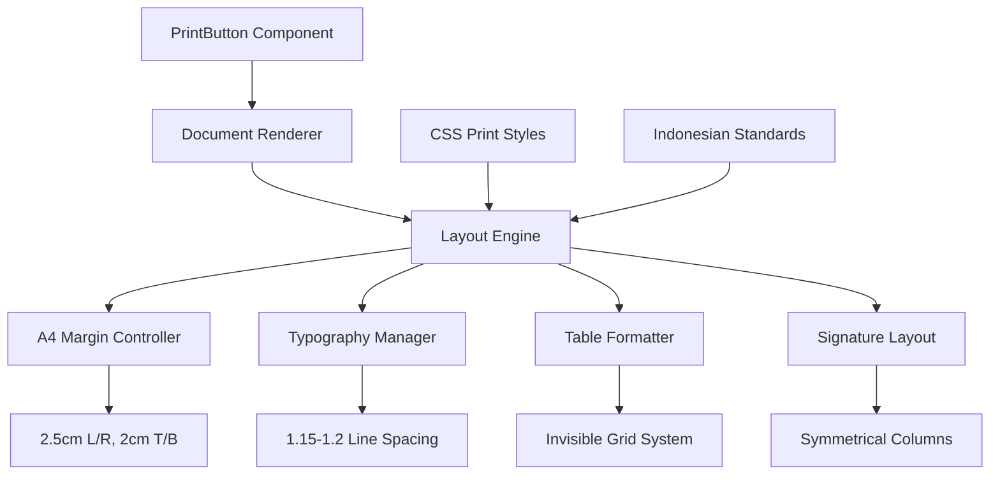

# Design Document

## Overview

This design document outlines the comprehensive improvements to the print layout system for Indonesian business documents (contracts and invoices). The solution focuses on implementing professional A4 formatting standards, proper spacing, alignment, and typography while maintaining the existing React-based architecture.

## Architecture

### Current System Analysis

The current print system uses:
- **PrintButton component**: Handles print functionality with modal-based document rendering
- **CSS-based print styles**: Located in `app/index.css` with extensive `@media print` rules
- **Document components**: Contract rendering in `components/Contracts.tsx`
- **Currency formatting**: Uses `Intl.NumberFormat('id-ID')` with IDR currency

### Proposed Architecture



## Components and Interfaces

### 1. Enhanced Print Styles (CSS)

**Location**: `app/index.css`

**Key Improvements**:
- **A4 Margin System**: Implement precise 2.5cm left/right, 2cm top/bottom margins
- **Typography Hierarchy**: Standardize line spacing to 1.15-1.2 with 6-8pt paragraph spacing
- **Table Layout**: Create invisible grid system for invoice alignment
- **Signature Layout**: Implement symmetrical two-column signature areas

```css
/* A4 Standard Margins */
@page { 
  size: A4 portrait; 
  margin: 20mm 25mm; /* 2cm top/bottom, 2.5cm left/right */
}

/* Optimized Line Spacing */
.print-document {
  line-height: 1.15 !important;
}

.print-document p {
  margin: 0 0 6pt 0 !important;
  line-height: 1.2 !important;
}

/* Invisible Table Grid for Invoices */
.invoice-table {
  border-collapse: collapse !important;
  width: 100% !important;
}

.invoice-table th,
.invoice-table td {
  border: none !important;
  padding: 4pt 8pt !important;
  vertical-align: top !important;
}

/* Symmetrical Signature Layout */
.signature-container {
  display: flex !important;
  justify-content: space-between !important;
  margin-top: 40pt !important;
}

.signature-column {
  width: 45% !important;
  text-align: center !important;
}
```

### 2. Currency Formatter Enhancement

**Location**: `components/Contracts.tsx` and shared utilities

**Current Implementation**:
```typescript
const formatCurrency = (amount: number) => {
    return new Intl.NumberFormat('id-ID', { 
        style: 'currency', 
        currency: 'IDR', 
        minimumFractionDigits: 0 
    }).format(amount);
};
```

**Enhanced Implementation**:
```typescript
const formatCurrency = (amount: number, options?: {
    showDecimals?: boolean;
    compact?: boolean;
}) => {
    const { showDecimals = true, compact = false } = options || {};
    
    return new Intl.NumberFormat('id-ID', {
        style: 'currency',
        currency: 'IDR',
        minimumFractionDigits: showDecimals ? 2 : 0,
        maximumFractionDigits: showDecimals ? 2 : 0,
        notation: compact ? 'compact' : 'standard'
    }).format(amount);
};
```

### 3. Document Layout Components

**Contract Layout Component**:
```typescript
interface ContractLayoutProps {
    contract: Contract;
    project: Project;
    profile: Profile;
    printMode?: boolean;
}

const ContractLayout: React.FC<ContractLayoutProps> = ({
    contract, project, profile, printMode = false
}) => {
    return (
        <div className={`document-container ${printMode ? 'print-contract' : ''}`}>
            <DocumentHeader profile={profile} />
            <ContractBody contract={contract} project={project} />
            <SignatureSection contract={contract} profile={profile} />
        </div>
    );
};
```

**Invoice Layout Component**:
```typescript
interface InvoiceLayoutProps {
    invoice: Invoice;
    items: InvoiceItem[];
    printMode?: boolean;
}

const InvoiceLayout: React.FC<InvoiceLayoutProps> = ({
    invoice, items, printMode = false
}) => {
    return (
        <div className={`document-container ${printMode ? 'print-invoice' : ''}`}>
            <InvoiceHeader invoice={invoice} />
            <InvoiceTable items={items} />
            <InvoiceTotals invoice={invoice} />
        </div>
    );
};
```

## Data Models

### Enhanced Document Models

```typescript
interface DocumentMargins {
    top: string;      // "2cm"
    bottom: string;   // "2cm" 
    left: string;     // "2.5cm"
    right: string;    // "2.5cm"
}

interface TypographySettings {
    lineHeight: number;        // 1.15 or 1.2
    paragraphSpacing: string;  // "6pt" or "8pt"
    fontFamily: string;        // "Manrope, sans-serif"
    fontSize: string;          // "12pt"
}

interface PrintLayoutConfig {
    margins: DocumentMargins;
    typography: TypographySettings;
    documentType: 'contract' | 'invoice' | 'receipt';
    showDecimals: boolean;
    useInvisibleGrid: boolean;
}
```

### Currency Formatting Model

```typescript
interface CurrencyFormatOptions {
    showDecimals: boolean;     // true for "Rp 10.416.183,30", false for "Rp 10.416.183"
    useThousandsSeparator: boolean; // Always true for Indonesian format
    decimalSeparator: string;  // "," for Indonesian
    thousandsSeparator: string; // "." for Indonesian
}
```

## Error Handling

### Print Layout Validation

```typescript
class PrintLayoutValidator {
    static validateMargins(margins: DocumentMargins): ValidationResult {
        // Validate A4 margin constraints
        // Ensure margins don't exceed page boundaries
    }
    
    static validateTypography(typography: TypographySettings): ValidationResult {
        // Validate line height is between 1.1 and 1.3
        // Ensure paragraph spacing is reasonable
    }
    
    static validateCurrencyFormat(amount: number): ValidationResult {
        // Validate number is finite and positive
        // Check for reasonable business amounts
    }
}
```

### Fallback Strategies

1. **Margin Fallback**: If custom margins fail, fall back to browser defaults
2. **Font Fallback**: If Manrope fails to load, use system sans-serif
3. **Currency Fallback**: If Intl.NumberFormat fails, use manual formatting
4. **Print Fallback**: If advanced print features fail, use basic browser print

## Testing Strategy

### Unit Tests

```typescript
describe('Currency Formatting', () => {
    test('formats Indonesian currency with decimals', () => {
        expect(formatCurrency(10416183.30, { showDecimals: true }))
            .toBe('Rp 10.416.183,30');
    });
    
    test('formats Indonesian currency without decimals', () => {
        expect(formatCurrency(10416183, { showDecimals: false }))
            .toBe('Rp 10.416.183');
    });
});

describe('Print Layout', () => {
    test('applies correct A4 margins', () => {
        const config = new PrintLayoutConfig();
        expect(config.margins.left).toBe('2.5cm');
        expect(config.margins.top).toBe('2cm');
    });
    
    test('uses proper line spacing', () => {
        const typography = new TypographySettings();
        expect(typography.lineHeight).toBeGreaterThanOrEqual(1.15);
        expect(typography.lineHeight).toBeLessThanOrEqual(1.2);
    });
});
```

### Integration Tests

```typescript
describe('Document Printing', () => {
    test('contract prints with proper formatting', async () => {
        const contract = createMockContract();
        const printResult = await printDocument(contract, 'contract');
        
        expect(printResult.margins).toMatchA4Standards();
        expect(printResult.signatures).toBeSymmetrical();
        expect(printResult.currency).toMatchIndonesianFormat();
    });
    
    test('invoice prints with aligned columns', async () => {
        const invoice = createMockInvoice();
        const printResult = await printDocument(invoice, 'invoice');
        
        expect(printResult.table).toHaveInvisibleBorders();
        expect(printResult.columns).toBeAligned();
        expect(printResult.totals).toBeRightAligned();
    });
});
```

### Visual Regression Tests

```typescript
describe('Print Layout Visual Tests', () => {
    test('contract layout matches design specifications', async () => {
        const screenshot = await captureContractPrint();
        expect(screenshot).toMatchSnapshot('contract-a4-layout.png');
    });
    
    test('invoice layout maintains column alignment', async () => {
        const screenshot = await captureInvoicePrint();
        expect(screenshot).toMatchSnapshot('invoice-table-alignment.png');
    });
});
```

### Manual Testing Checklist

1. **A4 Margin Verification**:
   - [ ] Print test document and measure margins with ruler
   - [ ] Verify 2.5cm left/right, 2cm top/bottom
   - [ ] Check header positioning relative to body

2. **Typography Testing**:
   - [ ] Verify line spacing appears neither cramped nor excessive
   - [ ] Check paragraph spacing consistency
   - [ ] Confirm font rendering quality

3. **Currency Format Testing**:
   - [ ] Test various amount ranges (thousands, millions, billions)
   - [ ] Verify decimal precision consistency
   - [ ] Check thousands separator and decimal separator

4. **Signature Layout Testing**:
   - [ ] Verify symmetrical positioning
   - [ ] Check proportional spacing
   - [ ] Test with and without signature images

5. **Cross-Browser Testing**:
   - [ ] Chrome print preview and output
   - [ ] Firefox print preview and output
   - [ ] Edge print preview and output
   - [ ] Safari print preview and output (if applicable)

## Implementation Phases

### Phase 1: CSS Print Styles Enhancement
- Update `@page` margins to A4 standards
- Implement optimized line spacing rules
- Create invisible table grid system
- Add symmetrical signature layout

### Phase 2: Currency Formatting Standardization
- Enhance `formatCurrency` function with options
- Implement consistent decimal handling
- Add validation for currency amounts
- Create utility functions for different contexts

### Phase 3: Document Structure Optimization
- Refactor contract rendering for better spacing
- Implement structured numbering system
- Add proper heading hierarchy
- Optimize white space distribution

### Phase 4: Testing and Validation
- Implement automated tests
- Conduct cross-browser testing
- Perform manual print quality verification
- Gather user feedback and iterate

## Performance Considerations

### Print Performance
- Minimize CSS complexity in print styles
- Optimize image sizes for print resolution
- Use efficient font loading strategies
- Implement lazy loading for non-critical print elements

### Memory Usage
- Clean up print windows after use
- Optimize DOM manipulation during print preparation
- Use efficient string formatting for currency
- Minimize re-renders during print preview

### Browser Compatibility
- Test across major browsers (Chrome, Firefox, Edge, Safari)
- Implement fallbacks for unsupported CSS features
- Use progressive enhancement for advanced print features
- Ensure graceful degradation on older browsers